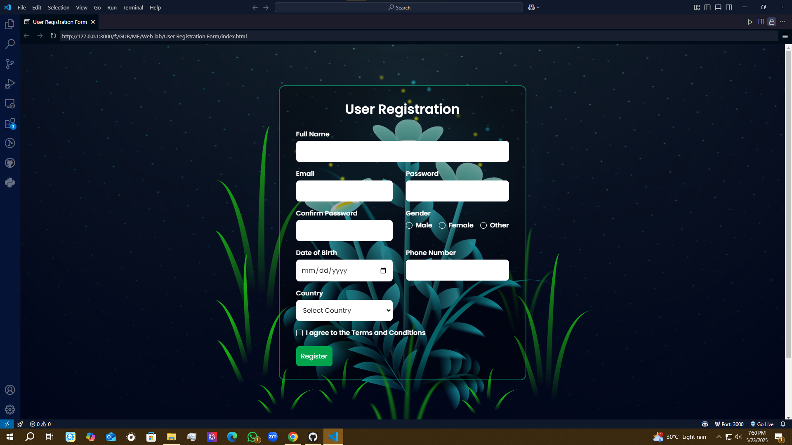

# User Registration Form with Animated Background

This project is a simple user registration form enhanced with an animated background. It uses HTML for structure, CSS for styling and animations, and JavaScript for form validation and interactivity. The form collects user information such as full name, email, password, gender, date of birth, phone number, country, and agreement to terms, providing a visually appealing and interactive experience.

## Features

- **Responsive Design**: Works seamlessly across various devices and screen sizes.
- **Animated Background**: Includes dynamic animations for a visually engaging user experience.
- **Client-Side Validation**: Validates fields like email, phone number, and password matching to ensure data integrity.
- **User Feedback**: Provides immediate feedback with error messages for invalid inputs and a success message upon successful submission.
- **Loading Spinner**: Displays a spinner during form processing to indicate activity.

## Usage

To use this registration form:
1. Open the `index.html` file in a web browser.
2. Fill out the form fields.
3. Submit the form. Validation will ensure all fields are correctly filled, and a success message will appear upon completion.

## Technologies Used

- **HTML5**: For structuring the form and content.
- **CSS3**: For styling, including responsive design and animations.
- **JavaScript**: For form validation, interactivity, and handling user feedback.

## Setup

1. Clone the repository to your local machine:
   ```bash
   git clone https://github.com/your-username/your-repo-name.git
   ```
2. Navigate to the project directory.
3. Open the `index.html` file in a web browser to view and interact with the form.

## Project Structure

- **`index.html`**: Contains the structure of the registration form.
- **`styles.css`**: Defines the styling and animations for the form and background.
- **`script.js`**: Handles form validation, submission, and user feedback.

## Limitations

- The form uses client-side validation only and does not include server-side validation.
- There is no backend integration to store registration data; this is a frontend-only project.

## Contributing

Contributions are welcome! If you find any issues or have suggestions for improvements, please:
1. Open an issue to report bugs or suggest features.
2. Submit a pull request with your proposed changes.

## License

This project is licensed under the MIT License. See the [LICENSE](LICENSE) file for details.

## Screenshot



## Requirements

- A modern web browser (e.g., Chrome, Firefox, Edge) to ensure compatibility with CSS animations and JavaScript features.
